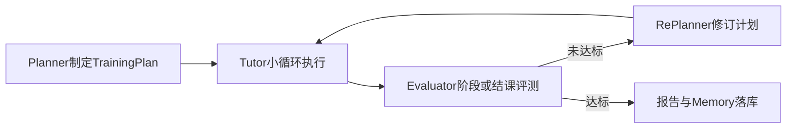
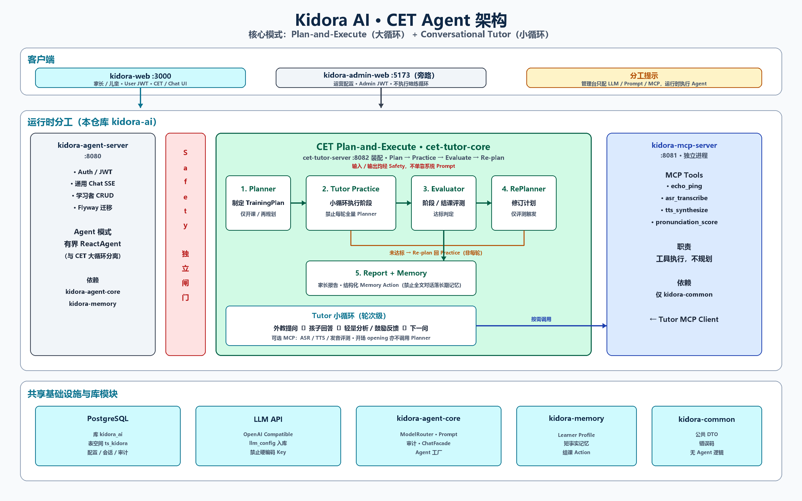
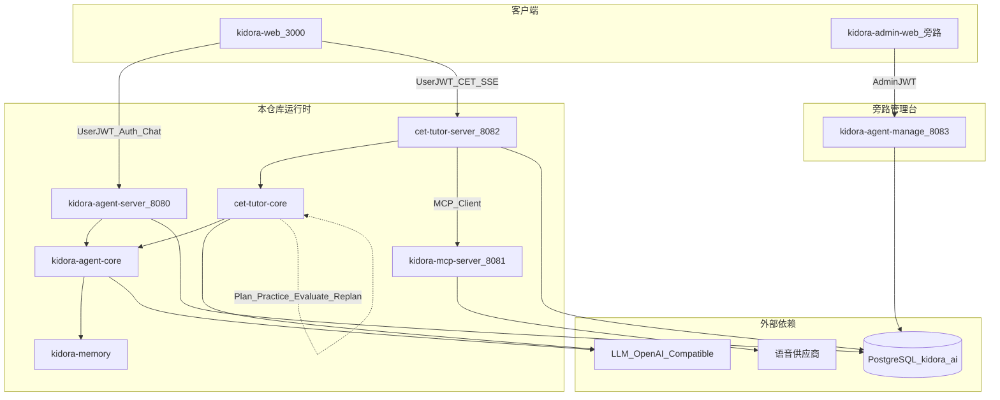

# Kidora AI

儿童健康与成长方向的 **Agent 平台运行时**仓库。首期产品：**Child English Tutor（CET）** — 儿童英语口语陪练。

## 仓库边界

| 仓库 | 职责 |
|---|---|
| **本仓库 `kidora-ai`** | 通用 Chat、CET 陪练、MCP 工具服务、`kidora-*` / `cet-*` 库、用户前台 `kidora-web`、共享库 schema |
| 旁路 [`kidora-ai-manage`](../kidora-ai-manage/README.md) | 运营管理台（Admin API + 管理前端）；不执行陪练循环 |

## 主要功能

- 家长注册 / 登录（User JWT）、儿童学习者档案 CRUD
- 通用大模型对话（OpenAI Compatible，SSE 流式）
- CET：开课规划 → 实时陪练 → 评测 / 再规划 → 结课报告
- 儿童 Safety Guard（输入 / 输出独立闸门）
- MCP 工具：ASR / TTS / 发音评测等（独立进程）
- 学习者短 / 长期记忆与画像（结构化落库，非全文对话归档）

## AI Agent 模式：Plan-and-Execute

CET **不是**「LLM + 一个聊天窗口」。会话级采用 **Plan-and-Execute** 大循环，轮次级采用 Tutor 对话小循环。



| 层次 | 模式 | 说明 |
|---|---|---|
| **大循环** | **Plan-and-Execute** | Plan → Practice → Evaluate → Re-plan → 结课；仅开课 / 阶段边界 / 结课触发完整规划或再规划 |
| **小循环** | Conversational Tutor | 外教问 ↔ 孩子答 ↔ 轻量反馈；**禁止**每句话同步完整 Planner |
| **通用 Chat** | 有界 ReactAgent | 与 CET 大循环职责分离，必须设置最大执行次数 |
| **Safety** | 独立闸门 | 规则 + 可选模型；不单靠系统 Prompt |
| **工具** | MCP | ASR / TTS / 发音等由 `kidora-mcp-server` 提供，CET 按需调用 |

实现落点：[`cet-tutor-core`](cet-tutor-core/README.md)（编排）+ [`cet-tutor-server`](cet-tutor-server/README.md)（API / SSE）。

### 架构总览图（Agent 模式与分工）



图示要点：左侧通用 **有界 ReactAgent**（Chat）；中部 CET **Plan-and-Execute**（Planner → Tutor Practice → Evaluator → RePlanner → Report/Memory）与 **Safety** 闸门；右侧独立 **MCP** 工具进程；管理台仅配置、不执行陪练循环。

## 部署拓扑



```
        kidora-web (:3000)              kidora-admin-web（旁路 manage）
                 |                                    |
                 |  User JWT / SSE                    |  Admin JWT
                 v                                    v
    kidora-agent-server (:8080)          kidora-agent-manage (:8083)
    Auth / Chat / learners
                 |
    cet-tutor-server (:8082)  ── MCP Client ──►  kidora-mcp-server (:8081)
                 |
            PostgreSQL（库 kidora_ai）+ LLM API
```

| 进程 | 端口 | 说明 |
|---|---|---|
| `kidora-web` | 3000 | 用户前台（Next.js） |
| `kidora-agent-server` | 8080 | Auth、通用 Chat、学习者、Flyway |
| `kidora-mcp-server` | 8081 | MCP Tools |
| `cet-tutor-server` | 8082 | CET 开课 / 陪练 SSE / 报告 |
| 旁路管理台 | 5173 / 8083 | 见 [`kidora-ai-manage`](../kidora-ai-manage/README.md) |

## 模块一览

无仓库级 parent POM；各子工程独立 `pom.xml`。`groupId`：`com.wuji.kidora.ai`。

| 模块 | 类型 | 职责 |
|---|---|---|
| [`kidora-agent-server`](kidora-agent-server/README.md) | Boot | Auth / Chat / learners / Flyway |
| [`kidora-mcp-server`](kidora-mcp-server/README.md) | Boot | MCP 工具服务 |
| [`cet-tutor-server`](cet-tutor-server/README.md) | Boot | CET HTTP / SSE |
| [`kidora-agent-core`](kidora-agent-core/README.md) | jar | 模型路由、Prompt、审计、Chat / Agent 工厂 |
| [`kidora-memory`](kidora-memory/README.md) | jar | 学习者画像与记忆 Action |
| [`kidora-common`](kidora-common/README.md) | jar | 公共 DTO / 错误码 |
| [`cet-tutor-core`](cet-tutor-core/README.md) | jar | CET Plan-and-Execute 与 Tutor / Safety |
| [`kidora-web`](kidora-web/README.md) | Next.js | 登录、CET 陪练、最小 Chat |

依赖方向（禁止环与反向）：

```
kidora-agent-server ──► kidora-agent-core ──► kidora-memory / kidora-common
cet-tutor-server    ──► cet-tutor-core    ──► kidora-agent-core / kidora-memory / kidora-common
kidora-mcp-server   ──► kidora-common
```

## 技术栈（锁定）

| 技术 | 版本 |
|---|---|
| Java | JDK 17 |
| Spring Boot | 3.4.8 |
| Spring AI | 1.1.0 |
| Spring AI Alibaba | 1.1.2.2 |
| 数据库 | PostgreSQL（库 `kidora_ai`，表空间 `ts_kidora`） |
| 前台 | Next.js（`kidora-web`） |

大模型接入统一 OpenAI Compatible；连接参数入库（`llm_config`），禁止代码硬编码模型名 / API Key。

## 数据库（开发）

| 项 | 值 |
|---|---|
| 主机 | `127.0.0.1:5432` |
| 库 | `kidora_ai` |
| JDBC | `jdbc:postgresql://127.0.0.1:5432/kidora_ai` |
| 凭据 | 见本地环境变量 / `application` 配置（勿将口令写入文档） |

首次：`schema/bootstrap` 建表空间与空库 → 启动 `kidora-agent-server`（Flyway 建表 + seed）。

## 最小本地启动

```powershell
# 依赖 jar
mvn -f kidora-common/pom.xml install -DskipTests
mvn -f kidora-memory/pom.xml install -DskipTests
mvn -f kidora-agent-core/pom.xml install -DskipTests
mvn -f cet-tutor-core/pom.xml install -DskipTests

# :8080 Auth / Chat
mvn -f kidora-agent-server/pom.xml -DskipTests package
java -jar kidora-agent-server/target/kidora-agent-server-1.0.0-SNAPSHOT.jar

# :8081 MCP（可选；语音需要）
mvn -f kidora-mcp-server/pom.xml -DskipTests package
java -jar kidora-mcp-server/target/kidora-mcp-server-1.0.0-SNAPSHOT.jar

# :8082 CET
mvn -f cet-tutor-server/pom.xml -DskipTests package
java -jar cet-tutor-server/target/cet-tutor-server-1.0.0-SNAPSHOT.jar

# :3000 前台
cd kidora-web
cp .env.local.example .env.local
npm install && npm run dev
```

| 用途 | 账号 |
|---|---|
| 用户前台 / API | `parent1` / `parent123`（Flyway seed，local/dev） |

敏感项可用环境变量覆盖，例如 `KIDORA_JWT_SECRET`、`KIDORA_LLM_API_KEY`、`KIDORA_MCP_ENABLED`。

## 能力摘要（按端口）

| 端口 | 能力 |
|---|---|
| `:8080` | 登录注册、家长资料、学习者 CRUD、通用 Chat SSE |
| `:8081` | MCP：`echo_ping` / `asr_transcribe` / `tts_synthesize` / `pronunciation_score` |
| `:8082` | CET 开课、Tutor SSE、结课评测、家长报告 |
| `:3000` | 浏览器端登录、CET 陪练、Chat |
