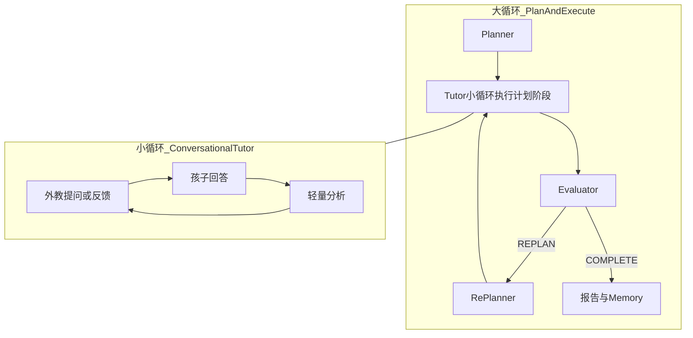

# cet-tutor-core

CET 域 **核心编排库**：实现儿童英语陪练的 **Plan-and-Execute 大循环** 与 Tutor **小循环**，以及 Safety / 评测 / 再规划。

## 主要功能

- **Planner**：开课生成结构化 `TrainingPlan`
- **Tutor**：按当前计划做实时多轮对话（轻量分析 + 鼓励式反馈）
- **Evaluator**：阶段边界与结课评测
- **RePlanner**：仅在评测决策为再规划时修订计划（非每轮）
- **Safety Guard**：输入 / 输出独立闸门
- 会话状态、轮次落库、结课报告与 Memory Action 协作

## 架构位置

```
cet-tutor-server ──► cet-tutor-core ──► kidora-agent-core
                              │              │
                              │              └──► kidora-memory / kidora-common
                              └── Safety / Planner / Tutor / Eval / RePlanner
```

由 [`cet-tutor-server`](../cet-tutor-server/README.md) 装配为 HTTP / SSE 服务；本模块本身不是可启动进程。

## AI Agent 模式：Plan-and-Execute

CET 采用经典 **Plan-and-Execute**，并拆成会话级与轮次级，避免口语场景延迟崩坏：



| 约束 | 说明 |
|---|---|
| 大循环 | Plan → Practice → Evaluate → Re-plan → 结课 |
| 小循环 | 外教 ↔ 孩子；**禁止**每句同步完整 Planner |
| 开场 | `opening` 路径无儿童输入也可先说；仍不调用 Planner |
| 工具 | ASR / TTS / 发音经 MCP Client，不替代规划器 |

相对「纯闲聊」：有可追踪教学目标与再规划；相对「每轮全量 Plan-and-Execute」：保证实时陪练体验。

## 技术栈

JDK 17 · 依赖 Spring AI Alibaba Agent / Prompt 能力（经 `kidora-agent-core`）· JDBC 访问 CET 表

## 相关模块

- 仓库总览：[../README.md](../README.md)
- 启动入口：[`cet-tutor-server`](../cet-tutor-server/README.md)
- 支撑：[`kidora-agent-core`](../kidora-agent-core/README.md) · [`kidora-memory`](../kidora-memory/README.md)
