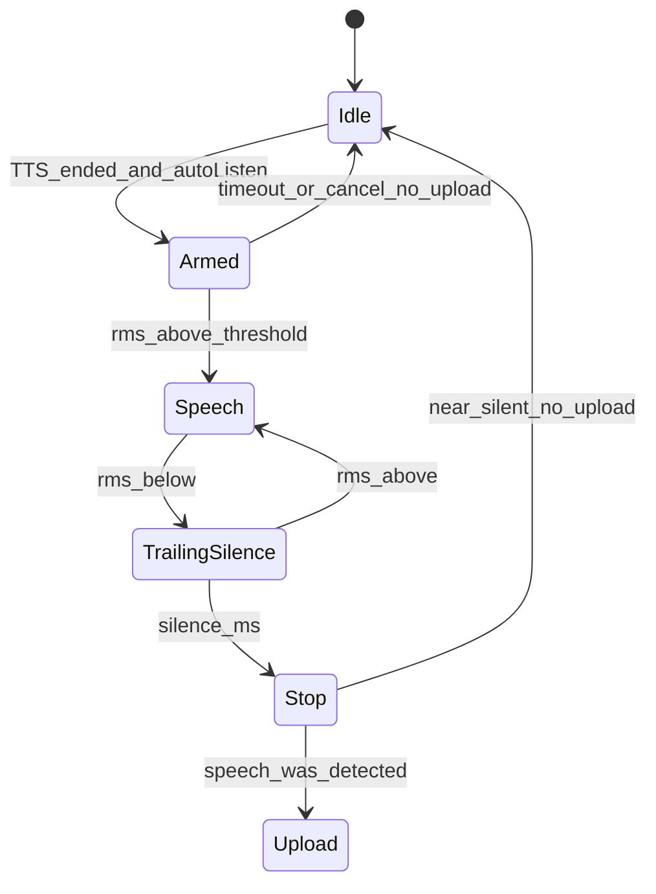

# CET 三目标展示 · 道具图 · 自动听设计

- **日期：** 2026-09-11
- **仓库：** `kidora-ai`
- **状态：** Implemented
- **关联：** [ui-design.md](../../ui-design.md)、[cet-lesson-flow.md](../../cet-lesson-flow.md)、[2026-09-11-cet-en-primary-scaffold-design.md](./2026-09-11-cet-en-primary-scaffold-design.md)

## 1. 背景与目标

陪练页目标不够条理；人像旁缺少教具图；录音需点按，且空麦若上传会浪费 ASR。

**本期目标：**

1. 儿童侧固定 **3 条递进目标**（认识 → 会说 → 用起来）。
2. 人像旁本地 **道具图**，按主题/词提示加载。
3. **Hands-free 短句**：外教 TTS 结束后自动开麦；本地 VAD + 静音门控，空麦不上云。

### 1.1 已确认决策

| 项 | 选择 |
|---|---|
| 目标来源 | plan_json.`childGoals`（3 条）；缺省则服务端合成 |
| API | `GET/POST` 会话详情与开课响应增加 `childGoals`、`vocabHints` |
| 进度高亮 | 前端用轮次/粗 stage 映射 1～3；不新增后端进度字段 |
| 道具 | `public/props/{theme}/` 静态资源；`resolvePropUrl`；缺图隐藏 |
| 自动听 | 默认开（`localStorage cet.autoListen`）；可关回手动录音 |
| 静音 | 本地 RMS/时长/VAD；从未起说则不 `streamTurn` |
| 说话人分离 | **不做** |

### 1.2 非目标

- 声纹 / diarization / 连续打断通话
- 儿童录音落库、道具 CDN、按轮 SSE 推道具 URL
- 结构化 Tutor JSON

## 2. 三目标（①）

### 2.1 Planner

`cet.planner.system` 要求输出 `childGoals`：恰好 3 条中文短句，语义递进。

Fallback（`LessonPlanner`）：按 topic / vocabulary / patterns 拼默认三条。

### 2.2 API

```json
{
  "sessionId": "...",
  "planSummary": "...",
  "childGoals": ["认识 pet/dog", "会说 I have a...", "用起来问答"],
  "vocabHints": ["pet", "dog", "cute"]
}
```

- `childGoals`：长度 ≤3
- `vocabHints`：从 `objectives.vocabulary` 等提取，最多 5

### 2.3 UI

顶栏折叠区展示 `1/3 · 2/3 · 3/3`；当前步高亮。粗映射：少轮次→1，中等→2，对话阶段→3。

## 3. 道具图（②）

- 路径：`/props/{pets|colors|food|default}/{lemma}.svg`（或 `.webp`）
- `PersonaStage`：默认单张 `propUrl`；若外教字幕含 Look/指认多实体（dog/cat/fish…），用 `resolveLookPropUrls` 展示最多 3 张道具条
- 人像卡右上约 72–96px（多图时横排收窄）
- 匹配：`vocabHints` 关键词 → 主题默认图 → `null`（不渲染）

## 4. 自动听（③）



参数建议：speech RMS ≈ 0.0035；起说确认 ~80ms；字间空隙容忍 ~180ms；尾静音 ~850ms；最长听 ~15s；最短有效响亮 ~280ms（不含尾静音）。首尾裁切峰值阈值 ≈ 0.0006（远低于起说 RMS，避免轻声被裁没后误报「没听到声音」）。

行为：

- TTS 播放期间不开麦；`beginVadListen` 若检测到仍在播则**拒绝开麦并延后重试**（禁止 `stopTutorVoice` 掐尾句）
- 自然 `ended` 后至少保留 `AUDIO_TAIL_MS`（约 0.5s）再业务收尾，且 **不在 ended 时立刻 revoke blob**，避免尾音节被掐；再按朗读稿估算补齐（`postEndedHoldMs`）
- TTS 朗读稿末尾若无句读则补 `.`，减轻厂商 MP3 尾帧裁切
- 播放使用 blob URL；停播先失效播放世代，避免清 `src` 的 `error` 被当成播完
- 勾选自动听时，点「开始说话」同样走 VAD（说完停顿自动发）；「停止并发送」仅提前收尾
- 主按钮聆听中为「停止并发送」；关闭自动听则与旧「录音」+ 手动停发一致
- 录音对象已拆除时提示「录音已结束…」，避免误导「尚未开始录音」
- stop 时可裁首尾近静音帧以减小上行；可接受 RMS 与裁切峰值分离

## 5. 验收

1. 新开课响应含 `childGoals`（3 条）与 `vocabHints`
2. 陪练顶栏可见三目标递进；道具位有主题图或隐藏
3. 自动听空麦：提示本地错误，网络无 ASR 请求
4. 自动听有声：与手动录音同等进入 `/stream`
5. 关「自动听」可回退手动点录
