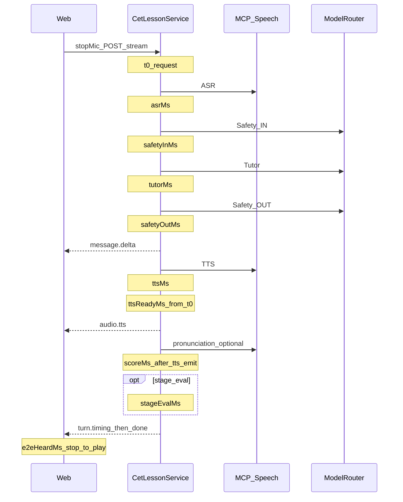

# CET 一轮陪练分段耗时统计设计

- **日期：** 2026-09-11
- **仓库：** `kidora-ai`
- **状态：** Implemented（2026-09-11）
- **关联：** [cet-lesson-flow.md](../../cet-lesson-flow.md)、[database-design.md](../../database-design.md)、[2026-09-11-cet-call-presence-ux-design.md](./2026-09-11-cet-call-presence-ux-design.md)、`CetLessonService.streamTurn` / `streamOpening`

## 1. 背景与目标

儿童停麦后外教开口慢，但仓库**没有**一轮端到端与 ASR/Safety/Tutor/TTS/评分的分段统计：仅有 `llm_call_log.latency_ms`（单次入模），MCP 语音路径无 duration。无法判断主耗时在大模型还是其它环节。

**目标（本期仅统计）：**

1. 对 `streamOpening` / `streamTurn` 关键路径做**墙钟分段计时**并落库。
2. SSE 下发服务端分段，供联调；儿童 UI **默认不展示**。
3. 客户端上报「停麦 → 外教音频开始播放」的 `e2eHeardMs`，合并进同一行 `timing_json`。
4. 固定分析 SQL 与**优化门禁**；候选优化列入 §7，**凭数据再开单，本期不实现优化**。

### 1.1 已确认决策

| 项 | 选择 |
|---|---|
| 落库 | `cet_tutor_turn.timing_json`（JSONB）；**不**复用 `signals_json` |
| 传输 | 新 SSE 事件名 `turn.timing`；位于 `audio.tts` 之后、`done` 之前（无 TTS 时仍在 `done` 前下发） |
| 客户端 | `POST .../turns/{turnIndex}/client-timing`，body `{ "e2eHeardMs": number }` |
| LLM 明细 | 不新建 LLM 账本；模型名/token 仍查 `llm_call_log`（`request_json->>'bizCaller'`） |
| 隐私 | `timing_json` **不含**音频、原文、ASR 全文；仅毫秒、枚举、布尔 skip |
| 儿童 UI | 不展示耗时数字 |
| Flyway | 现有迁移至 `V13__cet_opening_en_greeting.sql`；本规格占用 **`V14__cet_turn_timing.sql`**（若落地时 V14 已被占用则顺延号，列定义不变）。UX A+C 本期**不**占用 Prompt 迁移号 |

### 1.2 非目标

- 流式 TTS、ASR/Safety 并行、合并/减少 Safety 调用、发音评测移出主路径、预缓存确认音、MCP 连接池调优
- OpenTelemetry 全链路产品化（本期以 DB + 结构化字段为准；日志可附带同结构 JSON，不替代落库）
- 管理台图表（旁路 manage）；本期用 SQL 即可

---

## 2. 测量范围与时间线

覆盖当前串行实现（[`CetLessonService`](../../../cet-tutor-core/src/main/java/com/wuji/kidora/ai/cet/core/service/CetLessonService.java)）：



### 2.1 分段定义

| 字段 | 起止 |
|---|---|
| `asrMs` | `resolveChild` 内 ASR MCP 调用墙钟；文本路径为 0 |
| `safetyInMs` | `safetyGuard.checkInput` 全调用（含 L0）；未打模型时通常很小 |
| `tutorMs` | `tutorLoop.generateReply`（开场为 opening 生成） |
| `safetyOutMs` | `safetyGuard.checkOutput` |
| `ttsMs` | `port.tts(...)`；无 MCP/空文本跳过则为 0 |
| `scoreMs` | `port.score(...)`；未调用为 0；**在 `audio.tts` 发出之后**计时，不计入 `ttsReadyMs` |
| `persistMs` | 本轮关键路径上 turn insert/update 等 JDBC 合计（实现期用累加器；允许近似） |
| `stageEvalMs` | `maybeStageEvaluate` 整段；未触发为 0 |
| `ttsReadyMs` | `t0` → TTS 结果已就绪、即将发 `audio.tts`（无 TTS 则等于「字幕可展示完成」时刻相对 `t0`，并 `skipped.tts=true`）；**不含** score |
| `serverTotalMs` | `t0` → 准备发 `done` 之前（含 score、stageEval） |

计时使用 `System.nanoTime()`，写入毫秒整数（四舍五入）。

### 2.2 skip 语义

```json
"skipped": {
  "asr": true,
  "tts": false,
  "score": true,
  "safetyInModel": false,
  "safetyOutModel": false,
  "stageEval": true
}
```

- `asr` / `tts` / `score` / `stageEval`：该段**未调用**对应外部能力。
- `safetyInModel` / `safetyOutModel`：L0 已决、**未**调用 Safety LLM 时为 `true`；此时对应 `safety*Ms` 仍记录 L0 墙钟（通常近 0），与 `llm_call_log` 无 SAFETY 行一致。

实现期若难以从 `SafetyGuard` 返回是否打模，允许在 Guard 增加只读标志或包一层计时装饰；**不得**改变 Safety 决策语义。

---

## 3. `timing_json` 契约（schemaVersion = 1）

```json
{
  "schemaVersion": 1,
  "kind": "turn",
  "path": "voice",
  "asrMs": 0,
  "safetyInMs": 0,
  "tutorMs": 0,
  "safetyOutMs": 0,
  "ttsMs": 0,
  "scoreMs": 0,
  "persistMs": 0,
  "stageEvalMs": 0,
  "serverTotalMs": 0,
  "ttsReadyMs": 0,
  "skipped": {
    "asr": false,
    "tts": false,
    "score": false,
    "safetyInModel": false,
    "safetyOutModel": false,
    "stageEval": false
  },
  "client": {
    "e2eHeardMs": null,
    "reportedAt": null
  }
}
```

| 字段 | 约束 |
|---|---|
| `kind` | `"opening"` \| `"turn"` |
| `path` | `"voice"` \| `"text"`（有 `audioBase64` 为 voice） |
| `client.e2eHeardMs` | 服务端落库时先为 `null`；客户端上报后写入非负整数 |
| `client.reportedAt` | ISO-8601 UTC 字符串；未上报为 `null` |

开场轮：`kind=opening`，`child_text` 可空，`asr` 必 skip。

---

## 4. DDL

`schema/13_cet_tutor_turn.sql` 与权威 `schema/all.sql` 实现期同步追加列；Flyway：

```sql
-- V14__cet_turn_timing.sql（号段按落地时顺延）
ALTER TABLE cet_tutor_turn
    ADD COLUMN IF NOT EXISTS timing_json JSONB;

COMMENT ON COLUMN cet_tutor_turn.timing_json IS
    '一轮陪练分段耗时（毫秒）与 skip/client 上报；不含音频与对话原文';
```

Repository：`updateTutorText` 同路径或紧随其后 `updateTimingJson(turnId, json)`；须在 SSE `turn.timing` 发出前尽量落库（失败只打 warn，仍下发内存中的 timing，避免拖死儿童路径）。

---

## 5. SSE 与 HTTP API

### 5.1 SSE：`turn.timing`

- [`CetStreamEvent.Type`](../../../cet-tutor-core/src/main/java/com/wuji/kidora/ai/cet/core/speech/CetStreamEvent.java) 新增 `TIMING`。
- Controller 映射 event 名：**`turn.timing`**（与现有 `message.delta`、`audio.tts`、`asr.transcript` 命名风格一致）。
- `data`：§3 JSON **不含**依赖客户端的字段亦可先下发（`client` 全 null）；与落库服务端字段一致。
- 顺序：`[asr.transcript?] → message.delta* → [audio.tts?] → [pronunciation?] → turn.timing → [plan.updated?] → done`。  
  `plan.updated` 若由 stageEval 产生，其耗时计入 `stageEvalMs`，事件仍可在 `turn.timing` 前或后；**锁定**：`turn.timing` 在 `done` 之前最后一条业务事件之一，且 **`stageEvalMs` 已计入**（即 stageEval 完成后再发 `turn.timing`）。推荐顺序：`… → pronunciation? → plan.updated? → turn.timing → done`。

### 5.2 客户端上报

```
POST /api/cet/sessions/{sessionId}/turns/{turnIndex}/client-timing
Authorization: Bearer <user JWT>
Content-Type: application/json

{ "e2eHeardMs": 5230 }
```

- 鉴权与会话归属同现有 turn TTS 接口。
- 校验：`e2eHeardMs` 为整数，`0 ≤ e2eHeardMs ≤ 600000`；越界 400。
- 行为：读取该 turn 的 `timing_json`，合并 `client.e2eHeardMs` 与 `client.reportedAt=now(UTC)` 写回；无行 404；幂等：允许覆盖为最后一次上报。
- 开场：`turnIndex` 为 opening 写入的那一轮 index（与 `GET .../turns` 一致）。

### 5.3 前端采集口径

- `tStop`：语音路径在 `recorder.stop()` resolve 成功时刻；文本路径在 `send` 发起 `/stream` 前。
- `tHeard`：外教音频元素首次 `playing`/`timeupdate` 且 `currentTime>0`，或 `HTMLAudioElement.play()` resolve 且未立即 pause；仅浏览器 SpeechSynthesis 兜底时，以 `utterance.onstart` 为准。
- `e2eHeardMs = tHeard - tStop`。
- 上报失败不影响陪练；静默 retry 至多 1 次。

---

## 6. 分析口径与优化门禁

### 6.1 对照 LLM 审计

```sql
-- 单会话各次入模
SELECT create_time,
       request_json->>'bizCaller' AS caller,
       latency_ms,
       model_id,
       status
FROM llm_call_log
WHERE biz_source = 'CET'
  AND biz_ref_id = '<lesson_session_id>'
ORDER BY create_time;
```

`tutorMs` ≈ 同学段 `CET_TUTOR` 的 `latency_ms`；`safetyInMs`/`safetyOutMs` 在未 skip model 时与两次 `SAFETY` 同量级（含本地 JSON 解析开销）。

### 6.2 分段分位（语音轮）

```sql
SELECT
  percentile_cont(0.5) WITHIN GROUP (ORDER BY (timing_json->>'asrMs')::int) AS asr_p50,
  percentile_cont(0.95) WITHIN GROUP (ORDER BY (timing_json->>'asrMs')::int) AS asr_p95,
  percentile_cont(0.5) WITHIN GROUP (ORDER BY (timing_json->>'tutorMs')::int) AS tutor_p50,
  percentile_cont(0.95) WITHIN GROUP (ORDER BY (timing_json->>'tutorMs')::int) AS tutor_p95,
  percentile_cont(0.5) WITHIN GROUP (ORDER BY (
      (timing_json->>'safetyInMs')::int + (timing_json->>'safetyOutMs')::int)) AS safety_p50,
  percentile_cont(0.95) WITHIN GROUP (ORDER BY (
      (timing_json->>'safetyInMs')::int + (timing_json->>'safetyOutMs')::int)) AS safety_p95,
  percentile_cont(0.5) WITHIN GROUP (ORDER BY (timing_json->>'ttsMs')::int) AS tts_p50,
  percentile_cont(0.95) WITHIN GROUP (ORDER BY (timing_json->>'ttsMs')::int) AS tts_p95,
  percentile_cont(0.5) WITHIN GROUP (ORDER BY (timing_json->>'scoreMs')::int) AS score_p50,
  percentile_cont(0.95) WITHIN GROUP (ORDER BY (timing_json->>'scoreMs')::int) AS score_p95,
  percentile_cont(0.5) WITHIN GROUP (ORDER BY (timing_json->>'ttsReadyMs')::int) AS ready_p50,
  percentile_cont(0.95) WITHIN GROUP (ORDER BY (timing_json->>'ttsReadyMs')::int) AS ready_p95,
  percentile_cont(0.5) WITHIN GROUP (ORDER BY (timing_json->'client'->>'e2eHeardMs')::int)
    FILTER (WHERE timing_json->'client'->>'e2eHeardMs' IS NOT NULL) AS e2e_p50,
  percentile_cont(0.95) WITHIN GROUP (ORDER BY (timing_json->'client'->>'e2eHeardMs')::int)
    FILTER (WHERE timing_json->'client'->>'e2eHeardMs' IS NOT NULL) AS e2e_p95
FROM cet_tutor_turn
WHERE timing_json IS NOT NULL
  AND timing_json->>'path' = 'voice'
  AND create_time > now() - interval '7 days';
```

校验缺口：`asr+safetyIn+tutor+safetyOut+tts+score+persist+stageEval` 与 `serverTotalMs` 的差（调度/未包裹代码）；实现期单测用 mock 固定差值上界。

### 6.3 决策门禁（必须满足再开优化单）

对 `path=voice` 且样本量 **≥ 30** 轮（含 client 上报的 e2e 分析另要求 **≥ 20** 条非空 `e2eHeardMs`）：

1. 若某段 **p95 小于 300ms** 且该段 p95 / `ttsReadyMs` 的 p95 **小于 15%** → **暂不优化**该段。
2. 若 `(safetyInMs+safetyOutMs)` 的 p50 **≥** `tutorMs` 的 p50 × **0.7** → 优先评估 Safety 次数/模型/L0 扩大（§7 O1）。
3. 若 `ttsMs` p50 **≥** `tutorMs` p50 × **0.5** → 再评估流式/句级 TTS 或另开「短话术 Prompt」规格（当前 UX A+C **未**收紧话术长度）（§7 O2）。
4. 若 `scoreMs` p95 **≥ 500ms** 且儿童主界面仍不展示分数 → 优先移出关键路径（§7 O3）。**（2026-09-11 已落地：`speechExtrasFlux`）**
5. 若 `client.e2eHeardMs - ttsReadyMs` 的 p50 **≥ 800ms** → 优先查上传体量、代理、自动播放拦截（前端/网络），而非先改模型。

早期门禁跑数见 [gate-analysis](./2026-09-11-cet-turn-latency-gate-analysis.md)；下一优化规格见 [O1 Safety](./2026-09-11-cet-turn-latency-o1-safety-design.md)。

---

## 7. 候选优化（非本期；门禁触发后另开规格）

| ID | 方向 | 依赖字段 |
|---|---|---|
| O1 | Safety：合并入出站、缓存、扩大 L0、更快小模型 | **已落地最小集（2026-09-11）**：`L0_FAST_ALLOW` / `L0_OUT_SKIP_MODEL`；见 [o1-safety](./2026-09-11-cet-turn-latency-o1-safety-design.md) |
| O2 | Tutor 真流式 + 句级/流式 TTS | `tutorMs`、`ttsMs`、`ttsReadyMs`、`e2eHeardMs` |
| O3 | 发音评测出听感关键路径（`speechExtrasFlux`：TTS 先发再 score） | **已落地（2026-09-11）**；`scoreMs` 仍记入 `serverTotalMs` |
| O4 | ASR 流式/并行（与 Safety 重叠需谨慎） | `asrMs`、`ttsReadyMs` |
| O5 | 停麦预缓存确认音（感知） | `e2eHeardMs`、`ttsReadyMs` 差 |
| O6 | MCP/HTTP 连接与超时调优 | `asrMs`/`ttsMs` 尾部 |

---

## 8. 实现落点（实现期；本设计阶段不改代码）

| 层 | 路径 |
|---|---|
| 计时与组装 | [`CetLessonService`](../../../cet-tutor-core/src/main/java/com/wuji/kidora/ai/cet/core/service/CetLessonService.java)、[`TurnTimingCollector`](../../../cet-tutor-core/src/main/java/com/wuji/kidora/ai/cet/core/speech/TurnTimingCollector.java) |
| 事件 | [`CetStreamEvent`](../../../cet-tutor-core/src/main/java/com/wuji/kidora/ai/cet/core/speech/CetStreamEvent.java) |
| 仓储 | [`CetTutorTurnRepository`](../../../cet-tutor-core/src/main/java/com/wuji/kidora/ai/cet/core/repo/CetTutorTurnRepository.java) |
| API | [`CetSessionController`](../../../cet-tutor-server/src/main/java/com/wuji/kidora/ai/cet/server/web/CetSessionController.java) |
| 迁移 | `kidora-agent-server/.../db/migration/V14__cet_turn_timing.sql` + [`schema/13_cet_tutor_turn.sql`](../../../schema/13_cet_tutor_turn.sql) + `schema/all.sql` |
| Web | [`session/[id]/page.tsx`](../../../kidora-web/src/app/cet/session/[id]/page.tsx)、[`api.ts`](../../../kidora-web/src/lib/api.ts) SSE 解析 + `postClientTiming` |
| 测试 | `TurnTimingCollectorTest` / `CetLessonServiceTest`；`CetSessionControllerTest` 映射 `turn.timing` |

---

## 9. 验收标准

1. 语音轮与文本轮、开场轮落库的 `timing_json` 含 §3 全部服务端字段；skip 与未调用一致。
2. SSE 出现 `turn.timing`，且顺序满足 §5.1。
3. 客户端在成功开播后上报，`client.e2eHeardMs` 可查；失败不影响会话。
4. 用 §6.2 SQL 能在有数据的库跑出分位；儿童主界面无耗时数字。
5. 文档 §10 所列章节在实现交付时已更新。

---

## 10. 文档同步（实现交付时必须同改）

| 文档 | 章节 |
|---|---|
| [`docs/cet-lesson-flow.md`](../../cet-lesson-flow.md) | stream 事件表增加 `turn.timing`；client-timing API |
| [`docs/database-design.md`](../../database-design.md) | `cet_tutor_turn.timing_json` |
| [`docs/ui-design.md`](../../ui-design.md) | 静默上报 e2e；儿童不展示 |
| [`schema/13_cet_tutor_turn.sql`](../../../schema/13_cet_tutor_turn.sql) / `all.sql` | 列 + COMMENT |
| 本规格 | 状态改为 Implemented |

---

## 11. 与 UX A+C 规格的边界

- [通话在场感 A+C](./2026-09-11-cet-call-presence-ux-design.md) 可与埋点**并行实现**；其方案 C 仅情绪贴纸，**不**改变 Tutor Prompt / 回复长度，故**不应**假设上线后 `ttsMs` 自动下降。
- 本规格**不**验收通话壳 UI 或贴纸；A+C **不**验收 `timing_json` 完备性。
