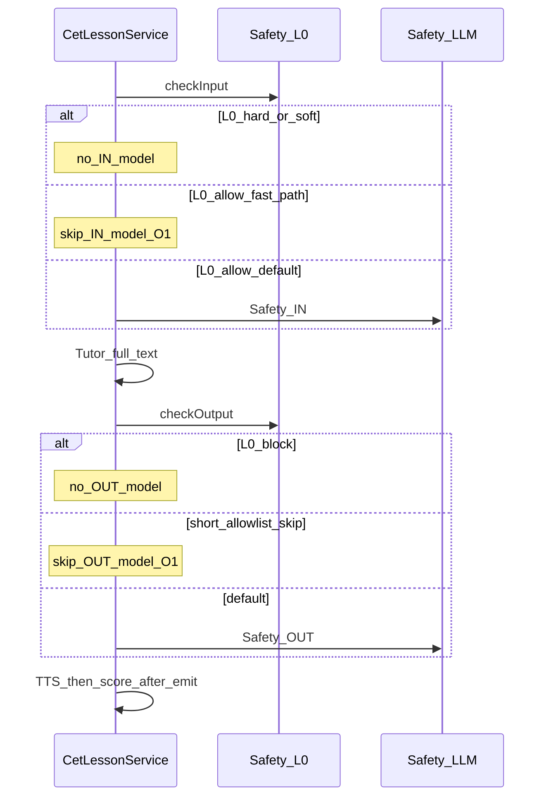

# CET 听感加速 O1：Safety 双调用减负设计

- **日期：** 2026-09-11
- **仓库：** `kidora-ai`
- **状态：** Implemented（2026-09-11；产品按早期门禁信号批准开工）
- **关联：** [2026-09-11-cet-turn-latency-metrics-design.md](./2026-09-11-cet-turn-latency-metrics-design.md)、[2026-09-11-cet-turn-latency-gate-analysis.md](./2026-09-11-cet-turn-latency-gate-analysis.md)、[cet-safety-design.md](../../cet-safety-design.md)、[CetLessonService.streamTurn](../../../cet-tutor-core/src/main/java/com/wuji/kidora/ai/cet/core/service/CetLessonService.java)

## 1. 背景与目标

停麦后外教开口慢。P0 已把发音评测移出听感关键路径（O3）。早期 voice 分位（N=6）显示：

| 段 | p50 |
|---|---|
| tutor | ~10.8s |
| safetyIn+Out | ~7.4s（≈ tutor × **0.68**，逼近门禁 0.7） |
| tts | ~3.1s（&lt; tutor × 0.5，**不**开 O2 全家桶） |
| e2e−ready gap | ~0.3s（不优先查前端） |

正常儿童轮几乎**两次** Safety LLM（入 + 出）：[`SafetyGuard`](../../../cet-tutor-core/src/main/java/com/wuji/kidora/ai/cet/core/safety/SafetyGuard.java) 仅在 L0 非 ALLOW 时短路；L0 ALLOW 仍 `checkModel`。

**本期目标（实现期）：** 在**不削弱儿童硬安全底线**的前提下，降低听感路径上 Safety 墙钟，使 `(safetyIn+safetyOut) p50` 明显下降，并尽量压到 tutor p50 的 50% 以下。

**非目标：**

- Tutor 真流式 / 句级 TTS（O2；本规格明确不做）
- 去掉 Safety 或仅靠 Tutor Prompt
- 改 Planner / Eval / Re-plan
- 管理台 Safety 策略产品化（旁路 manage）
- 预缓存确认音（O5）

### 1.1 已确认决策

| 项 | 选择 |
|---|---|
| 下一优化单 | **O1 Safety**（相对 O2 工程面小；门禁逼近；可安全评审） |
| O2 | **Defer**：等 O1 落地且 voice N≥30 复测后，若 tutor 仍主导再开独立规格 |
| 实现开工条件 | voice `timing_json` **≥30** 且仍满足 safety p50 ≥ 0.7×tutor p50，**或**产品明确批准在 N&lt;30 下按早期信号开工 |
| 安全失败策略 | 保持 **fail-closed**（模型失败 → SOFT_BLOCK）；禁止为加速改为 fail-open |
| 入站 | **保留**模型路径为默认；仅扩大明确无害 L0 快路径（见 §3） |
| 出站 | 允许「L0 通过 + 短鼓励白名单」跳过出站模型（见 §3）；否则仍打模型 |

---

## 2. 听感路径与改造点

---

## 3. 行为变更（锁定）

### 3.1 入站（INPUT）

1. **保持**现有 HARD/SOFT L0 关键词 → 立即 HARD/SOFT，不打模型。
2. **新增** `L0_FAST_ALLOW`（名称可实现期微调）：仅当文本同时满足：
   - 长度 ≤ 80 字符（可配置常量）；
   - 仅含：拉丁字母、数字、常见英文标点、空格、以及有限中文标点；
   - **不含**任何现有 HARD/SOFT 模式；
   - 匹配「课堂安全短答」启发式（实现期词表可单测）：如纯英文短句、yes/no、颜色/动物单词、`I like …` / `My … is …` 等模板（词表放 `SafetyGuard` 旁常量或小配置，**禁止**把策略只写在 Prompt）。
3. 命中 `L0_FAST_ALLOW` → 直接 `ALLOW`，`eventType=L0_FAST_ALLOW`，**不**调用 Safety LLM；`timing.skipped.safetyInModel=true`。
4. 未命中 → **仍**走现有 `checkModel`（默认路径不变）。

### 3.2 出站（OUTPUT）

1. **保持** L0 HARD/SOFT 对 Tutor 全文的拦截。
2. **新增** `L0_OUT_SKIP_MODEL`：当 L0 为 ALLOW，且 Tutor 全文同时满足：
   - 长度 ≤ 220 字符；
   - 不含 URL / 邮箱 / 电话模式；
   - 不含 HARD/SOFT 模式；
   - 命中「鼓励 + 课堂问句」结构启发式（可含中文脚手架句 + 英文例句；**不**要求改脚手架 Prompt）；
3. 命中则直接 `ALLOW`，跳过出站模型；`eventType=L0_OUT_SKIP_MODEL`；`skipped.safetyOutModel=true`。
4. 未命中或任何疑点 → **仍** `checkModel`；失败 fail-closed。

### 3.3 审计与可观测

- `cet_safety_event` 仍写入；新 `eventType` 进入既有字段，便于统计 skip 率。
- `timing_json.skipped.safetyInModel` / `safetyOutModel` 已支持；实现后用 SQL 看 skip 占比与 safety p50。
- 应用日志仍禁止完整敏感原文。

### 3.4 明确禁止的「加速」手段

- 并行跑 Safety IN 与 Tutor（未审输入不得入 Tutor 主路径）。
- 去掉出站闸门后先 SSE 再异步 Safety（会泄漏不安全 token）。
- 把 Safety 与 Tutor 合并成一次 LLM 调用却不保留独立策略版本（职责混淆；若未来要做须另开规格）。

---

## 4. 实现落点（实现期）

| 层 | 路径 |
|---|---|
| 规则 | [`SafetyGuard.java`](../../../cet-tutor-core/src/main/java/com/wuji/kidora/ai/cet/core/safety/SafetyGuard.java) |
| 单测 | `SafetyGuardTest`：FAST_ALLOW / OUT_SKIP 正反例；HARD 仍优先；模型失败 fail-closed |
| 文档 | [`cet-safety-design.md`](../../cet-safety-design.md) §3 增补 L0 快路径；本规格 → Implemented |
| 回归 | 现有 `CetLessonServiceTest` Soft/Hard 路径不回归 |

**配置：** 长度阈值可用 `SafetyGuard` 常量；若需运维可调，再进 `application.yml` `kidora.cet.safety.*`（实现期二选一，优先常量 + 单测，避免过早配置爆炸）。

---

## 5. 验收标准

1. 典型短英文儿童答（如 `I like dogs.`）入站 **不**产生 `llm_call_log` SAFETY IN 行；`skipped.safetyInModel=true`。
2. 典型短鼓励外教回复命中出站跳过时 **不**产生 SAFETY OUT 行；未命中长文/可疑文仍打模型。
3. HARD 关键词输入仍 HARD_BLOCK；SOFT 仍 SOFT_BLOCK；模型异常仍 SOFT_BLOCK。
4. 语音轮 SSE 顺序不变：`asr? → delta* → audio.tts? → pronunciation? → … → turn.timing → done`。
5. 复测：voice N≥30 后 safety p50 / tutor p50 **下降**；若仍 ≥0.7 或 tutor p50 仍 &gt;8s，另开 **O2** 规格（不在本单范围）。

---

## 6. 与 O2 的边界

| | O1（本规格） | O2（后续） |
|---|---|---|
| 对象 | Safety 次数 / L0 快路径 | Tutor 真流式 + 句级 TTS（或短话术） |
| 门禁 | safety/tutor ≈0.7 | tts/tutor ≥0.5 或 tutor 绝对主导且 O1 后仍慢 |
| 本期 | **已落地 Implemented 2026-09-11** | **不做**（O1 后 N≥30 复测再开） |

---

## 7. 文档同步（实现交付时）

| 文档 | 章节 |
|---|---|
| [`docs/cet-safety-design.md`](../../cet-safety-design.md) | §3 L0 快路径 / 出站 skip |
| [`docs/cet-lesson-flow.md`](../../cet-lesson-flow.md) | Safety 步骤注明可能 skip model |
| [gate-analysis](./2026-09-11-cet-turn-latency-gate-analysis.md) | 复测结果回写 |
| 本规格 | 状态 → Implemented + 日期 |
