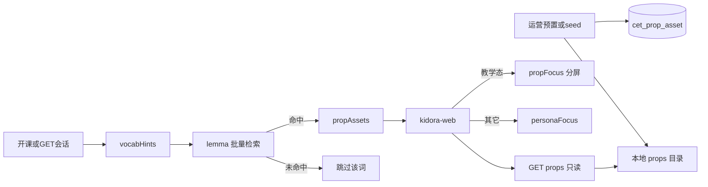
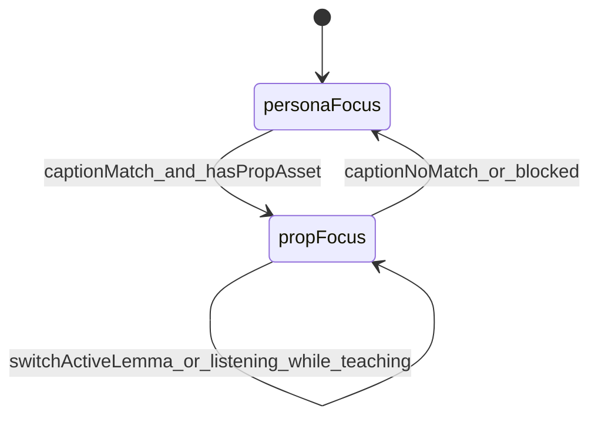

# CET 教具分屏舞台 · 本地道具库设计

- **日期：** 2026-09-13
- **仓库：** `kidora-ai`
- **状态：** Implemented；**§5.1 前端选图已 Superseded（2026-09-14）**
- **取代者（选图部分）：** [2026-09-14-cet-prop-realtime-stage-design.md](./2026-09-14-cet-prop-realtime-stage-design.md)
- **关联：** [ui-design.md](../../ui-design.md)

> 本文的道具库、分屏布局与 `GET /api/cet/props/{lemma}` 契约仍然有效。
> **但「前端用正则从字幕推断显示哪张图」已废弃**：该决策权已收回后端 `PropStageDirector`，
> 每轮通过 SSE `turn.prop` 事件下发，`session.propAssets` 只作预热提示。、[cet-lesson-flow.md](../../cet-lesson-flow.md)、[database-design.md](../../database-design.md)、[2026-09-11-cet-lesson-goals-props-autolisten-design.md](./2026-09-11-cet-lesson-goals-props-autolisten-design.md)、[2026-09-11-cet-persona-immersive-stage-design.md](./2026-09-11-cet-persona-immersive-stage-design.md)

## 1. 背景与目标

现状：人像右上角本地 SVG 道具过小、像装饰；与外教教词不同步，孩子不知道该看哪张图。静态 `public/props` 词覆盖窄，且无历史复用库。

**本期目标：**

1. **教学态左右分屏**：人像略让位，右侧大道具焦点；非教学态保持 immersive 人像主视觉。
2. **开课预取 `propAssets`**：按本课 `vocabHints`（≤5）**并合并会话 topic** 从本地历史库解析命中项，写入会话 REST（非 SSE）。（避免 vocabulary 仅有 hello/please 时主题实体漏检）
3. **运营预置本地库**：图落服务器本地磁盘；元数据入库；同 lemma **命中即复用**；未命中不放大、不外拉。

### 1.1 已确认决策

| 项 | 选择 |
|---|---|
| 痛点 | 看得见但没用 → 抢注意力 |
| 版式 | 教学态左右分屏（约 38% 人像 / 62% 教具） |
| 时机 | 仅教学态放大；Look/字幕命中已预取 lemma |
| 资产来源 | 开课预取 + 本地历史库复用 |
| 未命中 | 运营预置不足则该词不进 `propAssets`、不进分屏 |
| 交互 | 只看不点（点选作答非本期） |
| 管理入口 | 本仓 seed/脚本；日常上传旁路 `kidora-ai-manage`；本仓不暴露 `/api/admin/**` |

### 1.2 非目标

- 按轮 SSE 推道具 URL、结构化 Tutor 视觉 JSON
- 自动外网拉图 / AI 生图 / MCP `image_scene_query`
- 点选作答、闪卡复习产品
- Live2D / 口型同步
- 本仓库 Admin 上传 UI

## 2. 架构



硬约束：开课只查 ≤5 词；读图带 HTTP 缓存；道具失败不拖垮开课/SSE。

## 3. 数据模型

表 `cet_prop_asset`（`TABLESPACE ts_kidora`，全字段 `COMMENT ON`）：

| 字段 | 说明 |
|---|---|
| `id` | 雪花主键 |
| `lemma` | 规范词干（小写英文）；**UNIQUE** |
| `aliases_json` | 可选别名数组（如 `puppy`/`狗`） |
| `theme` | `pets` \| `colors` \| `food` \| `default` |
| `storage_path` | 相对本地根目录的路径（如 `pets/dog.webp`） |
| `content_type` | 如 `image/webp` |
| `byte_size` | 字节数 |
| `status` | `ACTIVE` \| `DISABLED` |
| `create_time` / `update_time` | 审计 |

配置：`kidora.cet.props.local-dir`（`cet-tutor-server`）指向文件根目录。大图不进 Git；可提供少量 seed。

检索：每个 `vocabHint` → 别名归一 → `lemma` 等值且 `ACTIVE`；一次 `WHERE lemma IN (...)`。

## 4. API

### 4.1 会话

`POST /api/cet/sessions` 与 `GET /api/cet/sessions/{id}` 增加：

```json
"propAssets": [
  { "lemma": "dog", "theme": "pets", "url": "/api/cet/props/dog" }
]
```

- 仅库内命中项；库空或全未命中 → `[]`，开课仍成功
- **不**新增 SSE 道具事件

### 4.2 只读取图

`GET /api/cet/props/{lemma}`：

- 鉴权与其它 CET API 一致（User JWT）
- 校验 `ACTIVE` 后流式返回本地文件
- `Cache-Control: public, max-age=86400`（或等价）
- 未知/禁用 → 404
- **禁止**把磁盘绝对路径写进 JSON

## 5. 前端交互

### 5.1 舞台态

| 态 | 条件 | UI |
|---|---|---|
| `personaFocus` | 默认；无命中；非教学字幕；blocked | immersive 人像为主 |
| `propFocus` | 字幕 Look/指认/问颜色且（字幕命中本课 `propAssets` **或** 教学态回退首张预取道具）；含教学句下的 listening | 左右分屏；当前 lemma 大图 + ≤3 缩略 |

过渡约 200–300ms；`prefers-reduced-motion` 瞬切。

- 宠物二选一指认（`cat or dog` / `猫还是狗`）优先按字幕中的具体实体展示 `cat`、`dog`；`pet` / `pets` / `animals` 等泛化词不能覆盖具体实体。
- 会话资产缺少具体猫狗时，前端回退本地真实图片 `pets/cat.png` 与 `pets/dog.png`；只有**非属性**的泛化宠物字幕时才使用 `pets/pet.png`（单只宠物图）。
- **属性问句**（颜色/大小）：若将展示的 lemma 仅为泛化 `pet`，升级为单只具体实体——颜色线索 `yellow/黄→dog`，`brown|grey|gray/棕|灰→cat`；无线索则取本课 `propAssets` 第一个 `cat|dog`，再默认 `dog`。见 [2026-09-14-cet-prop-singular-attribute-design.md](./2026-09-14-cet-prop-singular-attribute-design.md)。

### 5.2 状态机



- 候选集优先本课 `propAssets`；API 读图失败时前端可回退静态 `/props/{theme}/{lemma}.svg`
- 当前高亮：字幕中最后匹配的 lemma
- **教学指认句**在儿童 `listening` 时仍保持分屏（作答时要看见道具）；非教学句 / `blocked` 收起
- 图加载失败：先试静态回退，再移除该 lemma；全部失败 → `personaFocus`
- 道具只看不点

### 5.3 改动面

- `kidora-web/src/components/cet/PersonaStage.tsx`：`layout` 分屏
- `kidora-web/src/lib/lessonProps.ts`：消费 `propAssets`
- `kidora-web/src/app/cet/session/[id]/page.tsx`：开课字段 + caption 驱动态

## 6. 性能

- 开课：单次批量 `IN` 查询，无 N+1
- 可选进程内 `lemma → path` 小 LRU，减轻重复元数据查询
- 读图磁盘直出 + 浏览器缓存
- 上传侧（旁路/脚本）：限制 webp/png/svg 与单文件大小；与开课读路径隔离
- **不做**：开课同步外网、按轮全库扫描、blob 写入 `plan_json`

## 7. 验收

1. seed/入库后开课响应含命中 `propAssets`
2. 未入库词不在 `propAssets`，不触发分屏
3. 教学态左右分屏，当前词大图可见
4. 非教学态 / blocked → `personaFocus`；教学指认句在 listening 时仍 `propFocus`
5. 只读 props API 返回本地文件与缓存头；非法 lemma → 404
6. 库空时开课成功且 `propAssets=[]`
7. 单测：lemma 归一与批量检索；前端态切换（命中 / 无资产 / 加载失败）

## 8. 文档同步（实现同次交付）

- 本 spec 状态改为 Implemented
- 更新 `docs/ui-design.md`、`docs/cet-lesson-flow.md`、`docs/database-design.md`
- 必要时 `docs/cet-tutor-design.md` / `agents.md` 增加索引一句
