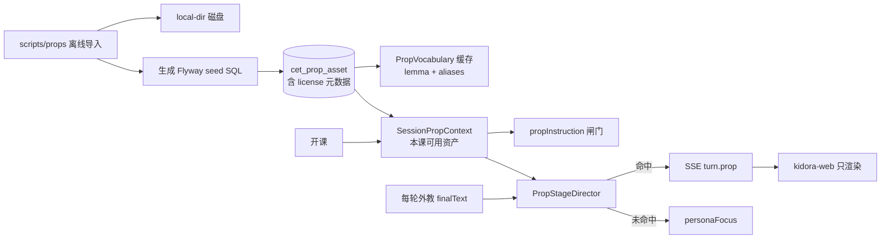

# CET 道具：实时动态下发 + 素材管理重构（设计）

- 日期：2026-09-14
- 范围：`cet-tutor-core` / `cet-tutor-server` / `kidora-web` / `schema` / `scripts/props`
- 取代：[2026-09-13-cet-prop-stage-library-design.md](2026-09-13-cet-prop-stage-library-design.md) §5.1 前端选图部分、[2026-09-14-cet-prop-singular-attribute-design.md](2026-09-14-cet-prop-singular-attribute-design.md) 全文

---

## 1. 背景与问题

改造前，「显示哪张道具图」的决策权在前端：

- 后端 `CetLessonService.resolveAvailablePropLemmas` 每轮查库算出本课可用道具，结果**只**用来填 `{{propInstruction}}`（V30 闸门），不下发前端。
- 真正的选图逻辑在 `kidora-web/src/lib/lessonProps.ts`，用正则匹配外教自由文本（`isTeachingCaption`），并硬编码宠物颜色特判（`yellow→dog`、`brown|grey→cat`）。这段绑死在当时三张猫狗图的实际颜色上，换素材即失效。
- **口径不一致（真 bug）**：`openLesson` 用 `propCandidateHints`（带停用词过滤），`getSession` 用 `propResolveHints`（不过滤），同一会话开课与续课/刷新拿到的 `propAssets` 不同。
- **词表四处重复**：`PropAssetResolver.ALIAS_TO_LEMMA`、`PropAssetResolver.PROP_STOP_WORDS`（与 `PlanLearningHints.PROP_STOP_WORDS` 逐字重复）、`lessonProps.ts` 的 `LEMMA_ALIASES` + `THEME_STEMS`。而 DB `cet_prop_asset.aliases_json` 才是权威。
- **素材双份且已漂移**：`cet-tutor-server/data/cet-props/pets/cat.png`（281709B）与 `kidora-web/public/props/pets/cat.png`（242449B）不是同一个文件。
- **管理面缺失**：`cet_prop_asset` 无任何来源/许可字段，seed 里 `byte_size` 全为 0，无「DB 有行但文件缺失」体检；取图走 `fetchAuthedBlobUrl`，每次挂载重新下载、卸载即 `revokeObjectURL`，后端 `Cache-Control` 吃不到。

## 2. 目标架构



三条硬约束：

1. 一次查询同时供 prompt 闸门与 SSE 舞台事件（`SessionPropContext`，一节课一次）。
2. 道具失败不影响 SSE 主流（判定异常只 WARN 并退化为 `personaFocus`）。
3. 前端不做任何语义判断。

## 3. 判定规则

**唯一规则：外教在本轮最终文本里点名了本课已发布道具，就展示它。**

> **已升级（2026-09-14）：** §3.1 的升级路径已落地，主图改由外教自己声明。当前口径见
> [2026-09-14-cet-prop-declared-lemma-design.md](2026-09-14-cet-prop-declared-lemma-design.md)；
> 本节描述的点名匹配从「唯一规则」降级为「声明缺失时的兜底」，匹配细节仍然有效。

- 匹配用 `PropVocabulary` 做别名归一，别名全部来自 `cet_prop_asset.aliases_json`；英文复数由通用构词规则还原（`cats→cat`、`boxes→box`、`babies→baby`），不需要逐个入库。
- 英文按词边界匹配，避免 `cat` 命中 `caterpillar`；中文按子串匹配。
- 按**字幕出现位置**排序，最多 3 张，`activeLemma` = 第一个（最早被点名的）。
- 没点名任何可用道具 → `personaFocus`。**没有任何正则、颜色线索或主题特判。**

配套提示词收紧：`{{propInstruction}}` 增加一句「提出图片问题时必须在句子里说出该英文词本身（例如 `Look at the dog! Is it big?`），否则孩子屏幕上不会出现任何图片」。这样「想让孩子看图」与「后端能看到」永远一致。

### 3.1 已知取舍与后续升级路径

**取舍：** 外教若说裸问句 `Look! What is this?`（不带具体词），屏幕上不会出图。这是有意为之——代价换掉的是一整套「教学句式正则」，那套东西无法覆盖模型的自由文本，且每次换素材/换话术都要跟着改。当前用提示词硬要求点名来兜底（V22/V23 本来就禁止裸 `Look! What is this?`，这里只是把它从建议变成硬要求）。

**若实际跑下来模型仍会漏词**，升级方向是让模型显式告诉我们要展示什么，**而不是把正则加回前端或后端**：在 Tutor 结构化输出里增加 `propLemma` 字段，`PropStageDirector` 优先采信该字段、点名匹配作为兜底。这条路的成本是改 prompt 与输出解析，收益是判定不再依赖自然语言匹配。 —— **已实施**，见上方提示。

**明确不做：** 任何形式的字幕句式正则、按颜色/主题猜实体、"教学态但未命中时回退第一张图"。最后这条尤其危险——它会让屏幕上出现外教根本没提到的东西。

### 4.1 SSE `turn.prop`

每轮在 `message.delta*` 之后、`audio.tts` 之前下发一次：

```json
{
  "layout": "propFocus",
  "activeLemma": "dog",
  "assets": [
    { "lemma": "dog", "theme": "pets", "url": "/api/cet/props/dog" },
    { "lemma": "cat", "theme": "pets", "url": "/api/cet/props/cat" }
  ]
}
```

未命中：`{"layout":"personaFocus","activeLemma":null,"assets":[]}`。

覆盖四条流：`streamOpening`、`streamTurn`、告别第 1 句、告别第 2 句（后两条恒发 `personaFocus`，把舞台收回人像）。soft redirect 与硬拦路径不发。

### 4.2 `GET /api/cet/props/{lemma}`

JWT；新增 `ETag`（优先取 `checksum_sha256` 前 32 位，缺失时退化为「文件长度-修改时间」）与 `If-None-Match` → `304`。`credits` 为**保留字**，不能作为 lemma。

### 4.3 `GET /api/cet/props/credits`

JWT，只读。返回 `attribution_required = TRUE` 的素材署名信息（`lemma`/`theme`/`source`/`license`/`licenseUrl`/`author`/`sourceUrl`），供前台 `/legal/credits` 渲染。

### 4.4 `session.propAssets`（`GET /api/cet/sessions/{id}` 与开课返回）

语义收窄为**预热提示**：前端拿它提前拉图进缓存，不再决定首帧布局。开课与续课/刷新现在共用 `PlanLearningHints.propCandidateHints`，结果必然一致。

## 5. 关键类型

| 类型 | 位置 | 职责 |
|---|---|---|
| `PropVocabulary` | `cet-tutor-core/.../props` | DB 驱动别名词表 + TTL 缓存（`kidora.cet.props.vocab-ttl-seconds`，默认 600s）；`normalize(token)`、`surfaceFormsOf(lemma)`；重载失败沿用旧快照 |
| `PropStageDirector` | 同上 | 按外教声明（优先）+ 文本点名（兜底）+ 可用资产判定 `PropStageView{layout, activeLemma, assets}` |
| `SessionPropContext` | 同上 | `sessionId → List<PropAssetView>` 会话级缓存（TTL / 容量上限），结课 / 中止 / 删除时 evict |
| `PropAssetResolver` | 同上 | hint → 资产；硬编码 `ALIAS_TO_LEMMA` / `PROP_STOP_WORDS` 已删除，停用词统一走 `PlanLearningHints.isPropStopWord` |
| `PropFileLocator` | `cet-tutor-server/.../props` | `storage_path` → 磁盘路径（禁止穿越）+ MIME 推断；相对 `local-dir` 兼容「从模块启动」与「从仓库根启动」两种工作目录 |
| `PropLibraryIntegrityChecker` | 同上 | 启动时体检「库里有行但磁盘缺文件」，只 WARN 不 fail-fast |

前端 `lessonProps.ts` 只剩类型 + `toPropStageView(payload)` + `goalStepFromTurnCount`；`resolvePropStage` / `isTeachingCaption` / `resolveSingularPetStem` / `LEMMA_ALIASES` / `THEME_STEMS` 全部删除，`lessonProps.selftest.ts` 的场景迁为后端 `PropStageDirectorTest`。

取图缓存：`fetchAuthedBlobUrl` 改为模块级 `Map<url, Promise<blobUrl>>`，同一 URL 一节课内只下载一次，组件卸载不再 `revokeObjectURL`。

## 6. 数据与素材管理

`V31__cet_prop_asset_license.sql` 为 `cet_prop_asset` 补齐 `source_code` / `license_code` / `license_url` / `author` / `source_url` / `attribution_required` / `checksum_sha256` / `width` / `height`，加两条白名单 CHECK，回填存量 11 行为 `local` + `PD`，并把原先写死在 Java 里的别名映射迁入 `aliases_json`。字段说明见 [database-design.md](../../database-design.md) §3。

离线导入与体检脚本在 `scripts/props/`，用法见 [`scripts/props/README.md`](../../../scripts/props/README.md)：

- `manifest.json` 声明批次、`idBase`、来源模板与逐条 `lemma`/`theme`/`aliases`
- `import-props.mjs`：下载 → 魔数识别真实类型 → 体积/尺寸上限 → SVG 拒绝内嵌脚本 → 落盘 → SHA-256 → 生成 `V3x__cet_prop_asset_seed_*.sql`（`ON CONFLICT (lemma) DO UPDATE`）→ 写 `props.lock.json`
- `verify-props.mjs`：锁文件 ↔ 磁盘 ↔（可选 `--dsn`）数据库三方比对，报缺文件 / 校验和漂移 / `byte_size=0` / 孤儿文件，有问题退出码 1
- **许可白名单硬校验**：非白名单 `licenseCode` 直接拒绝，不落盘并列入报告

首批素材：OpenMoji（CC-BY-SA 4.0，需署名）60 个，覆盖 `pets`/`food`/`colors`/`family`/`body`/`weather`/`numbers`/`school`/`clothes`/`transport`。`kidora-web/public/props` 的双份素材已删除，只留 `default/star.svg` 作为取图失败占位。

**生成任务边界：** 本仓库只负责 `enqueueMissing` 入队 `cet_prop_asset_generation_task`，不生成、不审核、不发布；这些在旁路仓库 `kidora-ai-manage`。

## 7. 验收

1. 开课与刷新/续课返回的 `propAssets` 完全一致（共用 `propCandidateHints`）
2. 外教说 `Look! A dog and a cat.` → `turn.prop` 且 `activeLemma=dog`；说 `Nice job!` → `personaFocus`
3. 空库开课成功、不推 `propFocus`、prompt 走「禁止图片指认」分支
4. `PropStageDirectorTest` 覆盖迁移过来的全部场景；`kidora-web/src/lib` 无宠物颜色特判残留
5. 每轮道具查库次数为 0（`SessionPropContext` 命中），道具异常不中断 SSE
6. 导入脚本对非白名单许可拒绝落盘；体检脚本对人为删文件能报出
7. 同一 lemma 在一节课内多次显示只发起一次 HTTP
