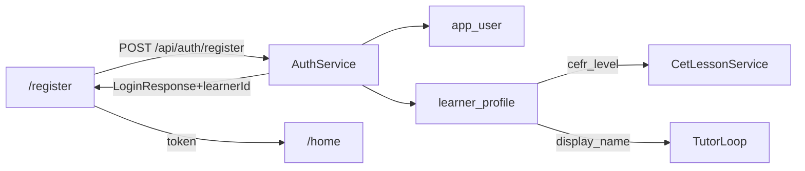

# 前台注册 + 儿童昵称 / 英语水平

- **日期：** 2026-09-14
- **仓库：** `kidora-ai`
- **状态：** Implemented
- **关联：** [ui-design.md](../../ui-design.md)、[architecture.md](../../architecture.md)、[agent-memory.md](../../agent-memory.md)

## 1. 背景与目标

现状：仅有 `POST /api/auth/login` 与演示账号；无注册；学习者靠 seed；Tutor 提示词未注入儿童昵称。

**本期目标：**

1. 前台 `/register` 一次提交：家长账号 + 首个儿童。
2. 儿童昵称写入 `learner_profile.display_name`，外教按昵称称呼。
3. 「英语水平」四档（非生理年龄）映射 `cefr_level`，驱动外教难度。

### 1.1 已确认决策

| 项 | 选择 |
|---|---|
| 注册范围 | 家长账号 + 首个儿童一次提交 |
| 水平 UI | 「英语水平」：启蒙 / 初级 / 中级 / 进阶 |
| 枚举 | `BEGINNER` / `ELEMENTARY` / `INTERMEDIATE` / `ADVANCED` |
| CEFR 映射 | A0 / A1 / A2 / B1（后端唯一真相） |
| `age_band` | 注册时 NULL |
| 家长字段 | 用户名 + 密码；`nickname` = username |
| 默认人设 | `emma` |
| 成功后 | 返回 JWT（同 login）+ `learnerId`，进 `/home` |

### 1.2 非目标

- 手机号 / 邮箱 / 验证码
- 多孩注册页、水平修改页
- 生理年龄、`age_band` 回填
- JWT claim 塞入 `learnerId`（仅响应体可选字段）

## 2. 架构



## 3. API

`POST /api/auth/register`（`permitAll`）

**请求：**

```json
{
  "username": "string",
  "password": "string",
  "childNickname": "string",
  "englishLevel": "BEGINNER|ELEMENTARY|INTERMEDIATE|ADVANCED"
}
```

**校验：** 用户名 3–64、密码 ≥6、昵称 1–32；非法档位 / 空字段 → `BAD_REQUEST`；用户名占用 → `BAD_REQUEST`「用户名已被占用」。

**落库：** 同事务插入 `app_user` + `learner_profile`；ID 用 `IdGenerator`。

**响应：** 与 login 同形，另含 `learnerId`。

## 4. Tutor 称呼

- `TutorLoop` opening / reply 注入 `{{displayName}}`。
- Flyway 更新 `cet.tutor.opening.*` / `cet.tutor.system`：用昵称称呼孩子。

## 5. 前端

- `/register`：四字段；成功 `setToken` → `/home`。
- `/login`：链到注册页。
